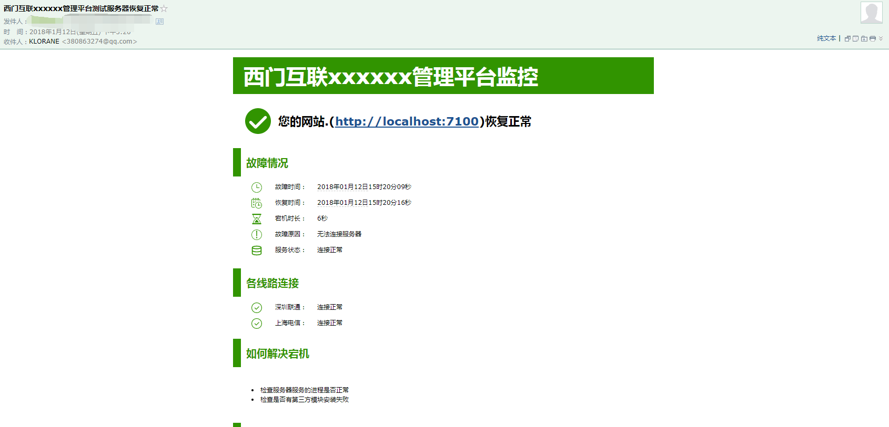
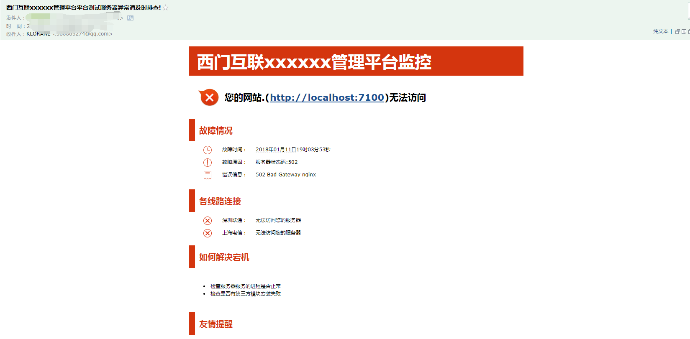
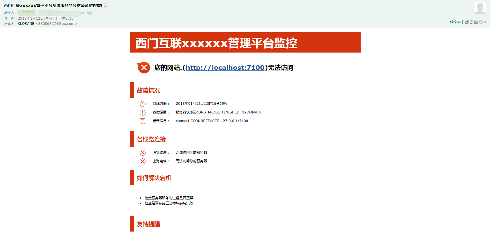

# node-website-monitoring
网站异常监控发送邮件及时排查错误修复

## 用法 默认163邮箱

```
//测试
// USER='邮箱' PASS='密码' node monit.js

//服务端
//USER='邮箱' PASS='密码' pm2 start monit.js --name monit --watch

```
## 效果图

> 正常



> 502




> 拒绝连接


